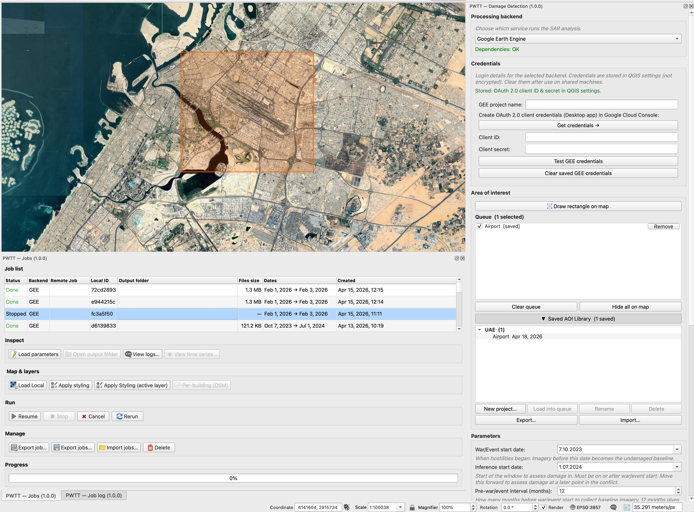
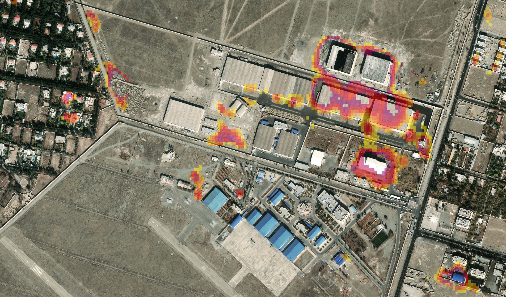
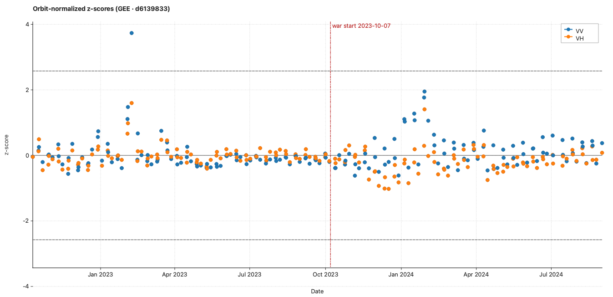

# PWTT QGIS Plugin — Battle Damage Detection

> A QGIS plugin that runs the **Pixel‑Wise T‑Test (PWTT)** on Sentinel‑1 SAR imagery to map building damage from conflict or other events. Pick one of three backends — **openEO**, **Google Earth Engine**, or **Local** — draw an AOI, set dates, and get result on the map.

-  🧪 **Method / reference implementation:** [oballinger/PWTT](https://github.com/oballinger/PWTT)
- **Paper:** [arXiv:2405.06323](https://arxiv.org/pdf/2405.06323)
- **Full technical reference:** [WIKI.md](docs/WIKI.md)
- **📝 User guide (blog):** [Link](https://salaheldinaz.com/blog/pwtt-qgis-plugin/)
- **📰 Case study (blog):**  [Link](https://salaheldinaz.com/blog/pwtt-qgis-plugin/)
- 🔧 **[WIKI.md](WIKI.md)** — full pipeline details: backends, temporal windows, GEE vs openEO vs Local, output bands, jobs, code map.

---

## Table of contents

- [What it does](#what-it-does)
- [Requirements](#requirements)
- [Installation](#installation)
- [Quick start](#quick-start)
- [Parameters](#parameters)
- [Backends at a glance](#backends-at-a-glance)
- [Output files](#output-files)
- [Reading colors on the map](#reading-colors-on-the-map)
- [Building a release](#building-a-release)
- [License](#license)

---

## What it does

**SAR (Sentinel‑1)** is radar from space — it measures microwave **backscatter** from the ground, which is affected by built structures. The plugin uses both polarisations (**VV** and **VH**) as complementary views of the same place. You only get **individual overpasses**, not a daily photo.

**PWTT (Pixel‑Wise T‑Test)** asks: *did backscatter change a lot between a **baseline** period and a **later** period, in a way that fits damage mapping?*

The workflow:

1. Summarise SAR over months **before** your war/event date.
2. Summarise SAR over months **after** your inference start date.
3. Compare them per pixel and polarisation → per‑pixel **change score** (`T_statistic`).
4. Mark **damage** where that score is **above** your cutoff (default **3.3**).

This is **era‑to‑era** comparison, not "damage from a single scene."

**What the plugin gives you:**

- A 3‑band **GeoTIFF** (`T_statistic`, `damage`, `p_value`), styled automatically on the map
- **`job_info.json`** with run metadata
- Optional **building footprints** (GeoPackage) with per‑polygon.
- Optional **TimeSeries sidecars** (GEE / Local) — per‑acquisition, orbit‑normalized z‑scores for the Jobs dock chart

---

## Requirements

- **[QGIS](https://qgis.org/) 3.22 or later**
- Backend‑specific Python packages (the plugin installs missing ones for you — see [Installation](#installation)):

  | Backend | Required packages |
  |---------|-------------------|
  | **openEO** | [`openeo`](https://pypi.org/project/openeo/) |
  | **Google Earth Engine** | [`earthengine-api`](https://pypi.org/project/earthengine-api/) |
  | **Local — CDSE** (Experimental) | [`numpy`](https://pypi.org/project/numpy/), [`rasterio`](https://pypi.org/project/rasterio/), [`requests`](https://pypi.org/project/requests/) |
  | **Local — ASF** (Experimental) | [`asf-search`](https://pypi.org/project/asf-search/) (Python 3.10+), `requests` |
  | **Local — Planetary Computer** (Experimental) | [`planetary-computer`](https://pypi.org/project/planetary-computer/), [`pystac-client`](https://pypi.org/project/pystac-client/), `requests` |
  | **Footprints (optional)** | [`geopandas`](https://pypi.org/project/geopandas/), [`rasterstats`](https://pypi.org/project/rasterstats/) |

Missing pip packages are installed into **`PWTT/deps/`** under your [QGIS user profile](https://docs.qgis.org/latest/en/docs/user_manual/introduction/qgis_configuration.html#user-profiles) (prefers a bundled **uv** binary, falls back to QGIS's `pip`). Click **Install Dependencies** in the PWTT panel when the plugin reports missing imports. The core raster stack (`numpy`, `rasterio`, `requests`) typically ships with QGIS.

---

## Installation

### Option A — Install from ZIP (recommended)

1. Build the release ZIP from the project root:

   ```bash
   ./scripts/build-release.sh
   ```

   Output: **`build/pwtt_qgis-<version>.zip`**.

2. In QGIS: **Plugins → Manage and Install Plugins → Install from ZIP** → select the ZIP.
3. Enable the plugin, then use **Install Dependencies** in the PWTT panel if anything is still missing.

### Option B — Install from folder 

1. Copy the repo contents into your QGIS profile's plugin folder (folder name **must** be `pwtt_qgis`):
   - **Linux/macOS:** `~/.local/share/QGIS/QGIS3/profiles/default/python/plugins/pwtt_qgis/`
   - **Windows:** `%APPDATA%\QGIS\QGIS3\profiles\default\python\plugins\pwtt_qgis\`
2. Restart QGIS → **Plugins → Manage and Install Plugins** → enable **PWTT — Battle Damage Detection**.
3. Use **Install Dependencies** in the PWTT panel as needed.

---

## Quick start



1. Open **PWTT — Damage Detection** from the **PWTT** toolbar or **Plugins → PWTT**.
   Other PWTT docks (toolbar‑toggleable): **Jobs**, **Job log**, **openEO Jobs**, **GRD staging** (CDSE offline ordering).
2. Pick a **processing backend** and enter credentials. Use **Install Dependencies** if imports fail.
3. Define the **AOI** — **Draw rectangle on map**, or enter bounds and **Set AOI from coordinates**.
   *"Hide on map" / "Show on map" only toggles the orange overlay — the stored rectangle is unchanged.*
4. Set **War/Event start date** and **Inference start date** (inference ≥ war/event start).
5. Set **Pre‑war/event interval** and **Post‑war/event interval** (months).
6. *(Optional)* Enable **Include building footprints** — current OSM, historical at war/event start, and/or historical at inference start ([Overpass API](https://overpass-api.de/)).
7. Adjust **Damage mask (T‑statistic cutoff)** if needed (default **3.3**; higher = stricter).
8. *(GEE only)* Choose **Detection method** (default **Stouffer**) and expand **Advanced options** (Welch vs pooled t, smoothing, urban mask, Lee filter mode).
9. *(GEE only)* Optionally check **Open interactive map in browser** (needs `geemap`).
10. Pick an **output directory**, confirm the summary dialog, **Run**.
    Progress appears in the task bar, **PWTT — Job log**, and the Jobs dock. Layers are added to the project when the job finishes.

---

## Parameters

| Parameter | Default | Description |
|-----------|---------|-------------|
| War/Event start date | *e.g. 2023‑10‑07* | Start of the conflict/event; pre window **ends** here. |
| Inference start date | *e.g. 2024‑07‑01* | Start of the post assessment window (must be ≥ war/event start). |
| Pre‑war/event interval | 12 months | Length of the pre‑event baseline. |
| Post‑war/event interval | 2 months | Length of the post‑event window. |
| T‑statistic cutoff | 3.3 | Binary **damage** (band 2) = `T_statistic > cutoff`. Higher → stricter. Not a probability. |
| GEE detection method | Stouffer | **GEE only.** Stouffer, Max, Z‑test, Hotelling T², or Mahalanobis — how per‑orbit tests are combined. |
| GEE advanced options | *(see UI)* | **GEE only.** Welch vs pooled t‑test; default vs focal‑only smoothing; urban mask before/after focal median; Lee per‑image vs composite. Persisted on jobs and **Rerun**. |

---

## Backends at a glance

| Backend | Where it runs | Auth | Key packages |
|---------|---------------|------|--------------|
| **openEO** | [Copernicus Data Space](https://dataspace.copernicus.eu/) (cloud) | OIDC browser or client id/secret | `openeo` |
| **Google Earth Engine** | [GEE](https://earthengine.google.com/) (cloud) | `ee.Authenticate()` + optional project | `earthengine-api` |
| **Local** | Your machine | CDSE creds / Earthdata creds (ASF) / optional PC key | `numpy`, `rasterio`, `requests` (+ source‑specific) |

- **openEO** — no local data download; result GeoTIFF is fetched when the batch job finishes.
- **GEE** — bundled `gee_pwtt` (synced with upstream): configurable **Detection method**, Welch/pooled t, smoothing and Lee modes. Download streams a 3‑band GeoTIFF to disk. Very large AOIs may need GEE Export to Drive.
- **Local** — pick source in UI: **CDSE**, **ASF**, or **Microsoft Planetary Computer**. Downloads Sentinel‑1 GRD to `<output_dir>/.pwtt_cache`, then runs an **openEO‑aligned** NumPy pipeline (σ⁰ linear, no Lee/log; pooled t‑style; same kernel idea as CDSE openEO). Defaults: up to **24** pre and **24** post scenes per job (cap **80**, setting `PWTT/local_max_scenes_per_period`). Disk and RAM scale with AOI × cap.

> 🧠 **Not sure which backend to pick?** See [WIKI — GEE vs openEO vs Local](WIKI.md#gee-vs-openeo-vs-local-why-results-differ-for-the-same-aoi).

---

## Output files

All files land in the **output directory** you chose:

| File | Contents |
|------|----------|
| `pwtt_*.tif` | 3‑band GeoTIFF: **band 1** `T_statistic`, **band 2** `damage` (binary, `T_statistic > cutoff`), **band 3** `p_value`. Local sets nodata = `-9999`. |
| `job_info.json` | Run metadata — parameters, `damage_threshold`, optional backend `processing_details`, timestamps. |
| `pwtt_job.json` | Export/import‑friendly job record (written when the job is saved). |
| `pwtt_*_footprints_*.gpkg` | *(optional)* Building polygons with a **`T_statistic`** column (mean of band 1 per polygon). Variants: `_current`, `_war_start`, `_infer_start`. |
| `pwtt_<job_id>_timeseries.json` | *(GEE / Local only)* Per‑acquisition, orbit‑normalized z‑scores for VV/VH. Read by the **Jobs dock** TimeSeries chart. |
| `pwtt_<job_id>_timeseries.csv` | Same as above, CSV (Earth Engine Code Editor–compatible). |

> openEO jobs don't currently write TimeSeries sidecars — the chart can't be reconstructed from `pwtt_*.tif` alone.

---

## Reading colors on the map

QGIS often opens the GeoTIFF as **multiband color** (band 1 → red, band 2 → green, band 3 → blue). **That RGB blend is not a damage heat map** — it mixes `T_statistic`, binary `damage` (0/1), and `p_value`, so hue does **not** map one‑to‑one to "how damaged."

For an intuitive reading of **band 1**, use **singleband pseudocolor**. The plugin's default ramp matches the reference PWTT Earth Engine preview (`core/viz_constants.py`, `core/qgis_output_style.py`):

- 🟡 **Yellow** at stretch **minimum** (default **3.0**)
- 🔴 **Red** at the **midpoint** (~4)
- 🟣 **Purple** at the **maximum** (default **5.0**)

So **higher** `T_statistic` in the window is **more purple**, **lower** is **more yellow**. Symbology min/max (or percentile stretch) controls which numeric range maps to those hues — change the ramp there if you want another metaphor.

| Color | Meaning (default 3 → 5 ramp) |
|-------|-------------------------------|
| 🟣 **Purple** | Near stretch **max** — strongest change signal within the display window. |
| 🔴 **Red** | Mid stretch — strong change. |
| 🟡 **Yellow** | Near stretch **min** — elevated signal, but the low end of this ramp. |

**After the layer is added:** Symbology changes the picture, **not** the raster values. Narrowing `max` (e.g. 5 → 4) makes strong change *look* more vivid without editing the file. **Band 2** is fixed to the cutoff used when the job ran — for a different mask, **re‑run** with another cutoff or use **Raster Calculator** on band 1.

Pixels **well below** your symbology minimum may render transparent or flat depending on QGIS settings — that's **not** "purple means undamaged." For a strict above/below mask, use **band 2** with singleband/two‑class symbology.





---

## Building a release

From the project root:

```bash
./scripts/build-release.sh              # build ZIP from current version in metadata.txt
./scripts/build-release.sh --bump       # bump version from last commit, then build
./scripts/build-release.sh --bump minor # bump minor version, then build
```

Version is read from `metadata.txt` (same file inside `pwtt_qgis/` in the ZIP). Output: **`build/pwtt_qgis-<version>.zip`**.

---

## License

Released under the [MIT License](LICENSE) (`SPDX-License-Identifier: MIT`).

PWTT methodology / GEE reference: **Oliver Ballinger**'s [`oballinger/PWTT`](https://github.com/oballinger/PWTT) (arXiv:2405.06323); see `core/gee_pwtt.py`.
