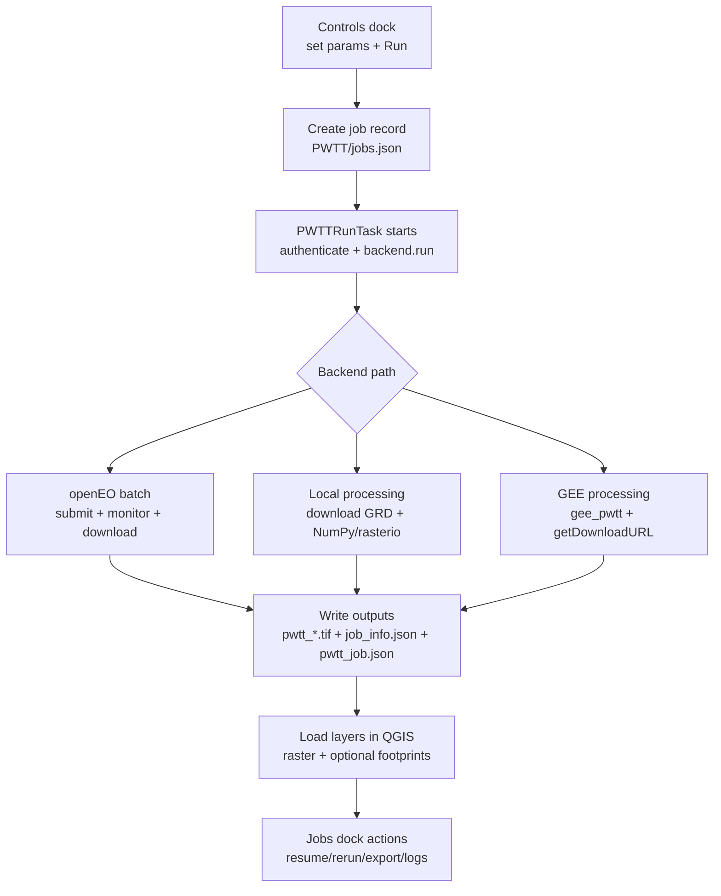

# PWTT QGIS Plugin — Technical Wiki

End‑to‑end reference for **what the plugin does** and **how each backend implements it**. For install and UI steps, see [README.md](README.md). For the PWTT paper: [arXiv:2405.06323](https://arxiv.org/pdf/2405.06323).

---

## Table of contents

1. [Overview](#1-overview)
2. [Map colors (QGIS)](#2-map-colors-qgis)
3. [What you configure](#3-what-you-configure)
4. [Plugin flow (orchestration)](#4-plugin-flow-orchestration)
5. [Temporal windows (conceptual)](#5-temporal-windows-conceptual)
6. [Sentinel‑1 GRD: what data you actually get](#6-sentinel1-grd-what-data-you-actually-get)
7. [TimeSeries chart (per‑acquisition z‑scores)](#7-timeseries-chart-peracquisition-zscores)
8. [Terms (VV, VH, and related SAR jargon)](#8-terms-vv-vh-and-related-sar-jargon)
9. [Backend: openEO (Copernicus Data Space)](#9-backend-openeo-copernicus-data-space)
10. [Backend: Local (GRD download + NumPy/rasterio)](#10-backend-local-grd-download--numpyrasterio)
11. [Backend: Google Earth Engine](#11-backend-google-earth-engine)
12. [GEE vs openEO vs Local: why results differ](#12-gee-vs-openeo-vs-local-why-results-differ-for-the-same-aoi)
13. [Output files (all backends)](#13-output-files-all-backends)
14. [Jobs and projects](#14-jobs-and-projects)
15. [Code map](#15-code-map)

---

## 1. Overview

The plugin compares **Sentinel‑1 GRD** VV/VH backscatter in a **pre** window (ending at war/event start) and a **post** window (from inference start) over your **AOI**, then writes a GeoTIFF (`pwtt_result.tif` or `pwtt_<job_id>.tif`) with three bands:

| Band | Name | Meaning |
|------|------|---------|
| 1 | **`T_statistic`** | Per‑pixel change score (continuous). |
| 2 | **`damage`** | Binary mask — `1` where `T_statistic > cutoff` (UI default **3.3**, job field `damage_threshold`). |
| 3 | **`p_value`** | Approximate significance (formula depends on backend). |

**openEO** and **Local** share σ⁰ linear radiometry and similar composites/kernels. **GEE** (`gee_pwtt`, from upstream [PWTT](https://github.com/oballinger/PWTT)) uses **Lee + log**, **per‑orbit** tests merged by the UI **Detection method**, **Dynamic World** urban masking, and **focal median + multi‑scale smoothing** — so **GEE** diverges more from **openEO/Local** than those two do from each other. See [§12](#12-gee-vs-openeo-vs-local-why-results-differ-for-the-same-aoi).

---

## 2. Map colors (QGIS)

The default **multiband RGB** (R=band 1, G=band 2, B=band 3) does **not** give a literal damage legend — it blends three different products.

For change strength on **band 1**, use **singleband pseudocolor**. The plugin's default is **yellow → red → purple** with min **3.0** / max **5.0** (`core/viz_constants.py`): **higher** `T_statistic` = **more purple**, **lower** = **more yellow**. See [README — Reading colors on the map](README.md#reading-colors-on-the-map). For a strict mask, use **band 2** with singleband/classified symbology.

**After the result is on the map:** edits under **Layer Properties → Symbology** (min/max stretch, opacity, ramp) are **display‑only** — `T_statistic` and `damage` pixel values in the GeoTIFF do not change. A **lower** max on band 1 maps the same values further toward the red–purple end, so change can look stronger on screen without changing band 2. To change **which** pixels are `1` in the damage mask, **re‑run** with a different cutoff or derive a new mask from band 1 (e.g. Raster Calculator).

---

## 3. What you configure

| Input | Meaning |
|-------|---------|
| **AOI** | Rectangle drawn on the map (stored as WKT). *"Hide on map" / "Show on map"* toggles the overlay only; coordinates are unchanged. |
| **War/Event start date** | Calendar date (`yyyy-MM-dd`). End of the pre baseline window and anchor for the "pre" extent. |
| **Inference start date** | Calendar date. Start of the post window. |
| **Pre‑war/event interval** | **Months** (integer). Baseline begins roughly `pre_interval` months **before** war/event start. |
| **Post‑war/event interval** | **Months** (integer). Post window extends roughly that many months **after** inference start. |
| **Output directory** | Folder for `pwtt_<job_id>.tif` (or `pwtt_result.tif`), optional footprint GeoPackages (`pwtt_<job_id>_footprints_*.gpkg`), `job_info.json`, and `pwtt_job.json`. |
| **Building footprints** | Optional; one or more OSM snapshot modes (current / historical at war/event start / historical at inference start). Each mode writes its own `.gpkg` with a `T_statistic` column. |
| **T‑statistic cutoff** | Default **3.3**; binary `damage` (band 2) = `T_statistic > cutoff`. Higher → stricter mask. Not a probability. |
| **GEE detection method** | **GEE only.** How per‑orbit statistics are combined: **Stouffer** (default), **Max**, **Z‑test**, **Hotelling T²**, or **Mahalanobis**. Stored as `gee_method`. |
| **GEE advanced options** | **GEE only.** **T‑test type** (Welch vs pooled), **Smoothing** (default multi‑scale vs focal‑only), **Mask urban pixels before focal median**, **Lee filter mode** (per‑image vs composite). Persisted as `gee_ttest_type`, `gee_smoothing`, `gee_mask_before_smooth`, `gee_lee_mode`. |

**Day vs month:** War/event start and inference start are **full dates**. Only the **length** of the baseline and post collections is set in **whole months** — there's no separate "N days" control.

**Backend** choice determines **where** computation runs and **exactly** how the change score is built.

---

## 4. Plugin flow (orchestration)

**Reading the chart:** top → bottom is lifecycle order. The split at **Backend path** means the same job envelope goes through one compute backend only (**openEO**, **Local**, or **GEE**) and then converges to the same output contract (`T_statistic`, `damage`, `p_value`) and the same Jobs dock controls.

### 4.1 Step by step

1. **Controls dock** — Set parameters and click **Run**. With **Google Earth Engine** selected, **Detection method** and collapsible **Advanced GEE options** appear; other backends ignore those fields.
2. **Job record** — A job is appended to the persistent job list (`PWTT/jobs.json` under the active profile's [QGIS settings directory](https://docs.qgis.org/latest/en/docs/user_manual/introduction/qgis_configuration.html#user-profiles) from `QgsApplication.qgisSettingsDirPath()` — **not** inside the `.qgz` project file).
3. **`PWTTRunTask` (QgsTask)** — Runs in the background: creates the output directory if needed, calls `backend.authenticate()` then `backend.run(...)` with `output_path = <output_dir>/pwtt_<job_id>.tif` when a job id exists, otherwise `pwtt_result.tif`.
4. **On success** — Job status → completed; `output_tif` stored on the job; `job_info.json` written beside the GeoTIFF (parameters, `damage_threshold`, optional backend `processing_details`); the raster (and footprint layers if any) is **added to the current QGIS project**. `pwtt_job.json` is also written in the output folder when the job record is saved (same envelope as export/import).
5. **Jobs dock** — Lists jobs; **Resume** / **Rerun** / **Delete**; export/import job JSON; zip single‑job bundles; **View logs**; progress. **Rerun** clones parameters (including **GEE** method and advanced options) into a **new** job id.

### 4.2 Runtime notes

- **openEO batch jobs:** While running, the log shows a server **batch job id** (`j-…`). The plugin **persists** that id on the job record in `jobs.json` when the backend reports it (for **Resume**). To re‑download results from the API you still need that id (or list jobs via the openEO client) within the provider's result retention policy (Copernicus Data Space retains completed job results for a limited period — check their current announcements).
- **Local cache:** Downloads go to **`<output_dir>/.pwtt_cache`**, not a global folder. If the backend is not Local, that cache is unused.

---

## 5. Temporal windows (conceptual)

For all backends the intent is:

- **Pre (baseline):** imagery from roughly **war/event start minus `pre_interval` months** through **war/event start**.
- **Post:** imagery from **inference start** through roughly **inference start plus `post_interval` months**.

**Implementation detail:** **openEO** and **Local** use the **same** calendar rule for window bounds — add/subtract months, clamping the day to **28** where needed (`_add_months` in `openeo_backend.py`, `_add_months_dt` in `local_backend.py`). **GEE** uses Earth Engine `Date.advance(..., "month")` on the full anchor dates. Backends can therefore disagree slightly on window edges for the same UI numbers (especially near month ends).

---

## 6. Sentinel‑1 GRD: what data you actually get

The plugin does **not** use "one SAR image per calendar day." **Sentinel‑1 GRD** products are **individual acquisitions** (satellite overpasses). Over your AOI, revisits follow S1's **repeat cycle** (often on the order of days, depending on mode, area, and whether you combine ascending/descending) — so within your pre/post **date ranges** you only get **the passes that actually exist** in the catalogue.

**What the windows mean:** All backends restrict data to GRD scenes whose acquisition time falls in the **pre** interval (baseline, ending at war/event start) and the **post** interval (starting at inference start). That is "all SAR images in those ranges" in principle, but each backend then **aggregates or subsamples** differently:

| Backend | How acquisitions in the window are used |
|---------|------------------------------------------|
| **openEO** | Every observation in the cube over each window feeds temporal **mean**, **variance**, and **count** per band → pooled t‑style composites per pixel (not a per‑date stack in the output file). |
| **Local** | Catalogue search returns candidate IW GRD products; the plugin downloads and uses **at most *N* pre and *N* post** scenes (**default *N* = 24**, **max 80**) — controlled by QGIS setting **`PWTT/local_max_scenes_per_period`**. |
| **GEE** | Image collections include **all** GRD images in the filtered date range that match AOI and mode; processing is **per relative orbit**, then combined (see [§11](#11-backend-google-earth-engine)). |

So: you are always working from **real GRD granules in your chosen months**, not synthetic "all days before/after," and **Local** deliberately **caps** how many granules enter the stack (tunable) to bound disk and runtime while tracking openEO more closely when *N* is large.

---

## 7. TimeSeries chart (per‑acquisition z‑scores)

The **TimeSeries chart** is a separate diagnostic view from the final raster. It plots **per‑acquisition, orbit‑normalized z‑scores** for **VV** and **VH** through time, while the GeoTIFF bands are the aggregated detection output (`T_statistic`, `damage`, `p_value`).

<!-- SCREENSHOT: docs/images/timeseries-chart-wiki.png -->

### 7.1 How it works

1. After a successful **GEE** or **Local** run, the backend writes sidecars next to `pwtt_*.tif`:
   - `pwtt_<job_id>_timeseries.json` — canonical record used by QGIS.
   - `pwtt_<job_id>_timeseries.csv` — EE Code Editor‑compatible export.
2. The chart dialog reads the JSON sidecar and renders a scatter plot:
   - **x‑axis:** acquisition date
   - **y‑axis:** orbit‑normalized z‑score
   - **series:** VV and VH
   - **reference lines:** dashed ±2.576 (`z_lower_99`, `z_upper_99`, ~99% two‑sided normal threshold)
   - **marker:** optional vertical **war/event start** line
3. Tooltips show date, orbit, pass direction, period (`pre` / `post`), and both z‑scores.

### 7.2 Important behavior

- If no sidecar exists, the chart **cannot** be reconstructed from `pwtt_*.tif` alone (the raster stores final aggregated bands, not per‑acquisition points).
- **openEO** jobs do not provide the same per‑acquisition sidecar path in this plugin, so this chart is primarily available for **GEE / Local** outputs that wrote sidecars.

---

## 8. Terms (VV, VH, and related SAR jargon)

| Term | Meaning in this plugin |
|------|-------------------------|
| **VV** | Co‑polarized Sentinel‑1 channel: transmit **V**ertical, receive **V**ertical. |
| **VH** | Cross‑polarized channel: transmit **V**ertical, receive **H**orizontal. |
| **Backscatter (σ⁰ / sigma naught)** | Radar return intensity normalized for geometry; main signal used for change scoring. |
| **Linear vs log radiometry** | openEO / Local paths here are linear σ⁰‑style; GEE path applies Lee + `log()` in its pipeline. |
| **Relative orbit** | Sentinel‑1 track index used by GEE pipeline to compute per‑orbit statistics before combining. |
| **Pass direction** | Ascending (south → north) or descending (north → south) overpass orientation. |
| **z‑score** | Standardized deviation from baseline (0 = baseline‑like; larger absolute = stronger anomaly). |
| **`T_statistic`** | Final per‑pixel change score exported in GeoTIFF band 1 (**not** the same object as per‑acquisition z‑score points). |
| **`damage`** | Binary mask in band 2 where `T_statistic > damage_threshold`. |
| **`p_value`** | Confidence‑style band in band 3; exact computation differs by backend pipeline. |

---

## 9. Backend: openEO (Copernicus Data Space)

- **Connection:** `https://openeo.dataspace.copernicus.eu`
- **Auth:** OIDC (browser) or client id + secret.

### 9.1 Processing graph

1. Load **SENTINEL1_GRD** (VV or VH per step) over pre/post **spatial bbox** and **temporal** windows; **SAR backscatter** σ⁰ ellipsoid (**no** Lee filter, **no** `log()` in this path).
2. Per polarisation: temporal **mean**, **variance**, and **count** → **pooled standard error** → `t = |post_mean − pre_mean| / SE` (pooled t‑test style on the composites).
3. `max(t_VV, t_VH)`; `p_value` from a **normal approximation** (not the same formula as GEE's CDF‑based p‑value; **no** orbit‑wise Bonferroni).
4. **No** per‑orbit split: **all** acquisitions in each window feed one composite per band (contrast GEE).
5. **No** Dynamic World urban mask.
6. **No** focal‑median step: circular **mean** kernels (discrete disks at ~50 / 100 / 150 m on a 10 m grid) on `max_change`.
7. `T_statistic = (max_change + k50 + k100 + k150) / 4`; `damage = 1` where `T_statistic > cutoff` (same surface as band 1; cutoff = UI `damage_threshold`).
8. Batch job → download GeoTIFF (**3 bands**: `T_statistic`, `damage`, `p_value`).

---

## 10. Backend: Local (GRD download + NumPy/rasterio)

- **Data source (UI):** **Copernicus Data Space (CDSE)**, **ASF (Earthdata Login)**, or **Microsoft Planetary Computer** (STAC `sentinel-1-grd`).
  CDSE may serve products from cold storage (staging / resume via **GRD staging** dock); ASF and PC use hot object storage.
- **Auth:** CDSE username/password; NASA Earthdata username/password (ASF); optional Planetary Computer subscription key (PC often works without a key).

### 10.1 Processing pipeline (openEO‑aligned)

1. **Search** Sentinel‑1 IW GRD for pre and post windows; **download** into `<output_dir>/.pwtt_cache` (CDSE OData; ASF SAFE zip; PC signed VV/VH COGs).
2. Take up to ***N*** pre and ***N*** post scenes (**default 24**, **max 80**, setting `PWTT/local_max_scenes_per_period`). **σ⁰ linear** backscatter — **no** Lee filter and **no** `log()` (same radiometry idea as the CDSE openEO graph).
3. **Welford** streaming mean / sample variance per pixel and band; **pooled t‑style** comparison of pre vs post composites for **VV** and **VH**; element‑wise **max** of the two polarisations → `max_change`.
4. **Circular kernel means** at ~50 / 100 / 150 m on a ~10 m grid applied to `max_change` (no separate Gaussian blur; no focal median). `T_statistic = (max_change + k50 + k100 + k150) / 4`.
5. **`p_value`:** conservative bound matching the openEO‑style normal approximation (`openeo_style_p_value_bound` in `local_numpy_ops.py`).
6. `damage = 1` where `T_statistic > cutoff` (UI default 3.3) — **same surface as band 1**, like openEO.
7. Write **GeoTIFF** (**3 bands**; nodata `-9999` where applicable). Optional **footprints**: one or more `pwtt_*_footprints_*.gpkg` files with a `T_statistic` column per polygon.

---

## 11. Backend: Google Earth Engine

- **Auth:** Earth Engine credentials; optional GEE project name.

### 11.1 Processing pipeline (bundled `gee_pwtt`, aligned with upstream PWTT)

1. Filter **`COPERNICUS/S1_GRD_FLOAT`** (IW, VV+VH) by AOI and post window; get **distinct relative orbits** in that window.
2. **Lee filter** (optional **per_image** on each scene, or **composite** only for Hotelling/Mahalanobis to save compute), then **`log()`** on σ⁰. Per‑orbit pre vs post tests use **Welch** or **pooled** t‑test style as selected in **Advanced GEE options**.
3. **Combine orbits** according to **Detection method**:

   | Method | Behavior |
   |--------|----------|
   | **Stouffer** (default) | Weighted Z combination by √df; Bonferroni ×2 for VV/VH. |
   | **Max** | Maximum *t* across orbits; Bonferroni uses orbit count (original PWTT‑style behavior). |
   | **Z‑test** | Latest post‑war/event image vs pre baseline per orbit, then max across orbits. |
   | **Hotelling T²** | Orbit‑wise z‑normalization, pooled pre/post composites, joint VV+VH test. |
   | **Mahalanobis** | *n*‑invariant effect size with closed‑form *p*‑value. |

   > *The QGIS download exports only the three standard bands (`T_statistic`, `damage`, `p_value`) regardless of method; extra EE diagnostic bands are not written to disk.*

4. **Dynamic World** "built" mean > 0.1 in the pre window defines an **urban mask**. *Mask before focal median* (default) applies that mask before the focal step; if unchecked, masking happens after focal median.
5. **Smoothing:**
   - **default** — focal median (10 m, Gaussian) then circular convolutions at 50 / 100 / 150 m with equal weights on those four layers → exported `T_statistic`.
   - **focal_only** — skips the convolutions (100% weight on the focal‑median layer).
6. `damage = 1` where `T_statistic > damage_threshold` (UI cutoff, default 3.3) — **same logical rule** as openEO and Local on the exported band 1.
7. **`getDownloadURL`** streams a GeoTIFF with bands `T_statistic`, `damage`, `p_value` only. Extra EE image bands (e.g. intermediate Z‑test or Hotelling/Mahalanobis diagnostics) are **not** included in the file the plugin writes.

> Very large AOIs may hit GEE download limits; export to Drive may be needed outside this plugin.

---

## 12. GEE vs openEO vs Local: why results differ for the same AOI

Using the **same rectangle and dates** in the UI does **not** guarantee matching rasters. Main reasons in **this** plugin:

| Topic | GEE (`gee_pwtt`) | openEO (`openeo_backend`) | Local (`local_backend` + `local_numpy_ops`) |
|-------|------------------|---------------------------|---------------------------------------------|
| **Product / radiometry** | `COPERNICUS/S1_GRD_FLOAT`, **Lee**, **`log()`** | `SENTINEL1_GRD`, **σ⁰ ellipsoid** | **σ⁰ linear** GRD, **openEO‑aligned** (no Lee / log) |
| **Combining orbits / passes** | **Per relative orbit** tests, merged by **Stouffer** (default), **max**, **ztest**, **Hotelling**, or **Mahalanobis** | **One** composite per window (all passes) | **Up to *N*** scenes per window (default 24, max 80), `max(VV, VH)` *t*‑style stack |
| **Urban mask** | **Dynamic World** "built" > 0.1 | **None** | **None** |
| **Smoothing** | **Focal median** (10 m) then optional multi‑scale convolutions (UI: default vs focal_only) | **No** focal median; discrete kernel disks on `max_change` | Same kernel idea as openEO on `max_change` (no focal median, no extra Gaussian) |
| **Binary `damage`** | Cutoff on exported `T_statistic` (band 1) | Cutoff on `T_statistic` | Cutoff on `T_statistic` |
| **`p_value`** | Normal CDF + Bonferroni‑style adjustments (depends on detection method) | Normal‑style bound in graph | `openeo_style_p_value_bound` (matches openEO intent) |

**Takeaway:** **openEO** and **Local** should be **closer** to each other than either is to **GEE**. **Qualitative** agreement in strong change areas is plausible across all three; **numerical identity** is not. Use **one** backend per analysis if you need a single consistent map.

<!-- SCREENSHOT: docs/images/backend-compare-wiki.png — side-by-side same AOI -->

---

## 13. Output files (all backends)

| File | Content |
|------|---------|
| `pwtt_*.tif` | Band 1: `T_statistic`. Band 2: `damage` (`T_statistic > cutoff`). Band 3: `p_value`. Values differ by backend — see [§12](#12-gee-vs-openeo-vs-local-why-results-differ-for-the-same-aoi). |
| `job_info.json` | Beside the GeoTIFF after success: parameters, `damage_threshold`, optional `processing_details`. |
| `pwtt_job.json` | In the output folder: persisted job envelope (mirror of export format). |
| `pwtt_*_footprints_*.gpkg` | Optional; building polygons with `T_statistic` per polygon (one file per selected footprint source). |
| `pwtt_<job_id>_timeseries.json` / `.csv` | GEE / Local only; per‑acquisition orbit‑normalized z‑scores for the Jobs dock chart. |

**Cutoff:** Band 2 uses the **T‑statistic cutoff** from the plugin UI (default 3.3, persisted as `damage_threshold`), applied to the exported `T_statistic` (band 1) for every backend. **GEE** still produces a different band 1 than openEO / Local because of the pipeline differences in §12.

---

## 14. Jobs and projects

- Jobs are **global to the QGIS profile** (`PWTT/jobs.json` next to `PWTT/deps/` under the profile's QGIS settings directory), shared across all projects opened in that profile.
- **Rerun** creates a **new** job with the same parameters (new id).
- **Resume** continues the **same** job when status allows (e.g. stopped, failed, openEO batch in progress, or waiting for offline products on Local CDSE).
- **Export / import** job lists as JSON; **Repair paths** if you moved output folders. Single‑job **ZIP** bundles include `job.json` plus output rasters/footprints when files are present.

---

## 15. Code map

| Area | Location |
|------|----------|
| Controls dock (run UI) | `ui/main_dialog.py` |
| Jobs dock | `ui/jobs_dock.py` |
| Job log dock | `ui/job_log_dock.py` |
| openEO jobs dock | `ui/openeo_jobs_dock.py` |
| GRD staging (CDSE offline) | `ui/grd_staging_dock.py` |
| Backend auth widgets | `ui/backend_auth.py` |
| Plugin entry, toolbar | `plugin.py` |
| Background task | `core/pwtt_task.py` |
| Job persistence / export | `core/job_store.py` |
| Dependencies (uv / pip) | `core/deps.py`, `core/_uv_manager.py` |
| openEO backend | `core/openeo_backend.py` |
| Local backend | `core/local_backend.py`, `core/local_numpy_ops.py`, `core/downloader.py`, `core/asf_downloader.py`, `core/pc_downloader.py` |
| GEE backend | `core/gee_backend.py`, `core/gee_pwtt.py` |
| Footprints | `core/footprints.py` |
| Layer styling | `core/qgis_output_style.py`, `core/qgis_layer_tree.py`, `core/viz_constants.py` |
